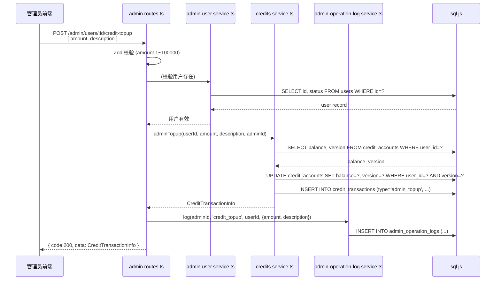
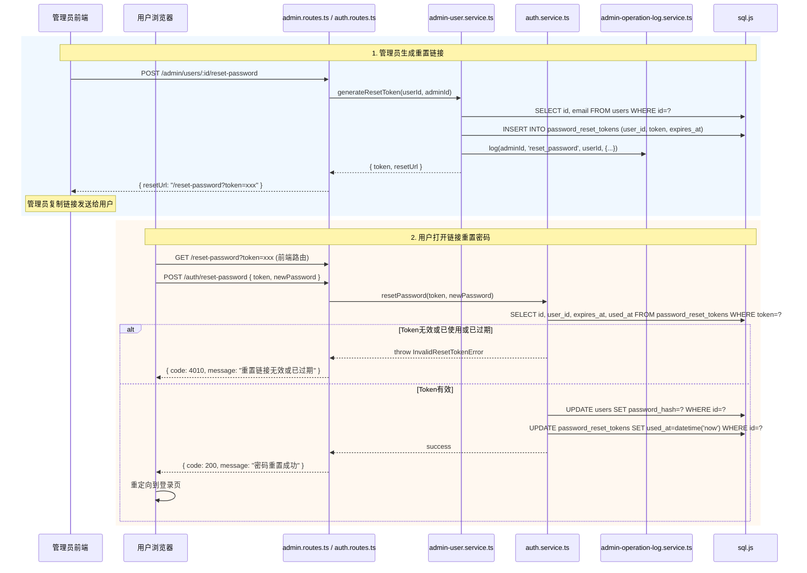
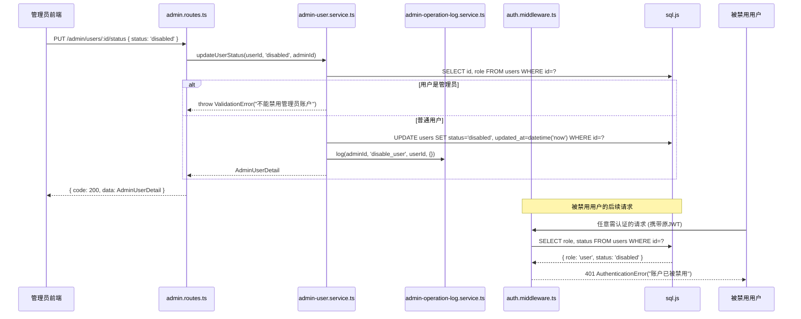
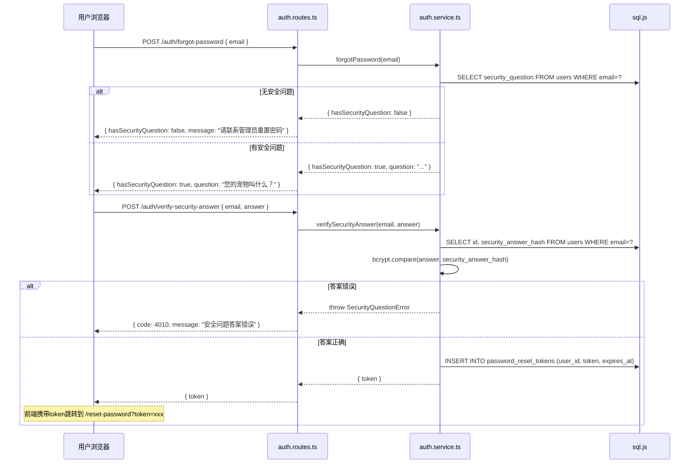
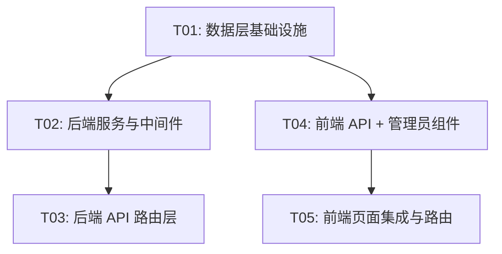

# AI创作聚合平台 — 管理员后台用户管理模块 系统设计

> 架构师：高见远（Gao）  
> 日期：2026-06-01  
> 版本：v1.0  
> 范围：P0 + P1 需求

---

## 1. 实现方案

### 1.1 核心技术挑战

| # | 挑战 | 解决方案 |
|---|------|----------|
| 1 | **数据库 Schema 变更** — 在 sql.js（内存 SQLite）上安全添加字段和新表，不能丢失已有数据 | 在 `migrate.ts` 中采用 `ALTER TABLE … ADD COLUMN` + `CREATE TABLE IF NOT EXISTS` 模式，与现有迁移策略一致（try/catch 忽略已存在字段） |
| 2 | **密码重置 Token 安全性** — UUID Token 生成、30 分钟过期、一次性使用 | 新建 `password_reset_tokens` 表，token 使用 `uuid v4`，`expires_at` 设为创建后 30 分钟，使用后写 `used_at`，查询时同时校验 |
| 3 | **管理员充值原子性** — 充值需同时更新余额和记录流水，且需记录操作管理员 | 复用 `credits.service.ts` 的乐观锁模式，新增 `adminTopup()` 函数；事务内同时写入 `admin_operation_logs` |
| 4 | **禁用用户 Token 即时失效** — 用户被禁用后，已发出的 JWT 仍然有效 | 在 `auth.middleware.ts` 查询用户时同步检查 `status` 字段，非 `active` 则抛出 `AuthenticationError`，利用已有"每次请求查库校验角色"的模式 |
| 5 | **前端 AdminPage 扩展** — 现有 AdminPage 已有 2 个 Tab（积分套餐 + AI模型），需新增用户管理和操作日志 Tab | 将 AdminPage 重构为 Tab 容器，用户管理相关组件拆到独立文件 `client/src/pages/admin/` 目录下 |
| 6 | **安全问题自助重置** — 用户可设置安全问题并自助重置密码 | `users` 表新增 `security_question` 和 `security_answer_hash` 字段；注册时可选设置；提供忘记密码流程 |

### 1.2 框架与库选型

| 层面 | 选型 | 理由 |
|------|------|------|
| 后端框架 | Fastify 4（已有） | — |
| 数据库 | sql.js（已有） | 原生 SQL，无 ORM |
| 参数校验 | Zod（已有） | 已在 admin.routes.ts 大量使用 |
| 密码哈希 | bcryptjs（已有） | — |
| UUID 生成 | uuid（已有） | auth.service.ts 已引入 `v4 as uuidv4` |
| 前端框架 | React 18 + MUI 5（已有） | — |
| 状态管理 | Zustand（已有） | 用户管理使用组件本地状态，与现有 PackageManager/ModelManager 模式一致 |
| HTTP 客户端 | axios（已有） | 通过 apiClient 封装 |
| 路由 | react-router-dom v6（已有） | — |

**无需新增第三方依赖。**

### 1.3 架构模式

沿用现有分层架构：

```
Route (Zod 校验 + Fastify handler)
  → Service (业务逻辑 + 原生 SQL)
    → DB (sql.js 内存数据库)
```

新增服务层遵循同样模式，不引入新的抽象层。

---

## 2. 文件列表

### 2.1 新增文件

| 相对路径 | 说明 |
|----------|------|
| `server/src/services/admin-user.service.ts` | 管理员用户管理服务（列表/详情/状态/充值/重置密码Token生成） |
| `server/src/services/admin-operation-log.service.ts` | 管理员操作日志服务（记录/查询） |
| `client/src/pages/admin/UserListTab.tsx` | 用户列表 Tab 组件（含搜索、筛选、分页表格） |
| `client/src/pages/admin/UserDetailDialog.tsx` | 用户详情弹窗（基本信息 + 积分余额 + 操作按钮） |
| `client/src/pages/admin/CreditTopupDialog.tsx` | 手动充值弹窗（含金额输入、上限校验） |
| `client/src/pages/admin/ResetPasswordDialog.tsx` | 生成密码重置链接弹窗（显示链接、复制功能） |
| `client/src/pages/admin/TransactionListDialog.tsx` | 用户积分流水弹窗（分页表格） |
| `client/src/pages/admin/BatchTopupDialog.tsx` | 批量充值弹窗（P1-03） |
| `client/src/pages/admin/OperationLogTab.tsx` | 操作日志 Tab 组件（P1-02） |
| `client/src/pages/ResetPasswordPage.tsx` | 公开密码重置页面（设置新密码） |
| `client/src/pages/ForgotPasswordPage.tsx` | 忘记密码页面（安全问题自助重置，P1-04） |

### 2.2 修改文件

| 相对路径 | 修改内容 |
|----------|----------|
| `server/src/db/migrate.ts` | 新增建表 SQL（password_reset_tokens、admin_operation_logs），ALTER TABLE users 添加 status/security_question/security_answer_hash 字段 |
| `server/src/db/schema.ts` | 更新 Schema 文档注释 |
| `server/src/types/index.ts` | 新增 AdminUserInfo、AdminUserDetail、PasswordResetToken、AdminOperationLog 等类型定义 |
| `server/src/utils/errors.ts` | 新增 UserNotFoundError、UserDisabledError、InvalidResetTokenError、SecurityQuestionError |
| `server/src/middleware/auth.middleware.ts` | 查询用户时增加 status 字段检查，禁用用户直接返回 401 |
| `server/src/services/credits.service.ts` | 新增 `adminTopup()` 函数（type='admin_topup'，含单次上限 100,000 校验） |
| `server/src/routes/admin.routes.ts` | 新增用户管理 API 路由（7 个端点） |
| `server/src/routes/auth.routes.ts` | 新增 3 个公开端点（reset-password、forgot-password、verify-security-answer） |
| `client/src/api/admin.ts` | 新增用户管理相关 TypeScript 接口和 API 函数 |
| `client/src/api/auth.ts` | 新增 resetPassword、forgotPassword、verifySecurityAnswer 接口和函数 |
| `client/src/pages/AdminPage.tsx` | 新增"用户管理"和"操作日志"Tab，导入新组件 |
| `client/src/router.tsx` | 新增 `/reset-password` 和 `/forgot-password` 公开路由 |
| `client/src/pages/RegisterPage.tsx` | 新增安全问题和答案输入（可选） |

---

## 3. 数据结构和接口

### 3.1 数据库表变更

#### users 表 — 新增字段

```sql
ALTER TABLE users ADD COLUMN status TEXT NOT NULL DEFAULT 'active';  -- 'active' | 'disabled'
ALTER TABLE users ADD COLUMN security_question TEXT;                  -- 安全问题（可选）
ALTER TABLE users ADD COLUMN security_answer_hash TEXT;               -- 安全答案哈希（可选）
```

#### password_reset_tokens 表 — 新建

```sql
CREATE TABLE IF NOT EXISTS password_reset_tokens (
  id INTEGER PRIMARY KEY AUTOINCREMENT,
  user_id INTEGER NOT NULL REFERENCES users(id),
  token TEXT NOT NULL UNIQUE,
  expires_at TEXT NOT NULL,
  used_at TEXT,
  created_at TEXT NOT NULL DEFAULT (datetime('now'))
);
```

#### admin_operation_logs 表 — 新建

```sql
CREATE TABLE IF NOT EXISTS admin_operation_logs (
  id INTEGER PRIMARY KEY AUTOINCREMENT,
  admin_id INTEGER NOT NULL REFERENCES users(id),
  target_user_id INTEGER,
  action TEXT NOT NULL,     -- 'credit_topup' | 'batch_topup' | 'reset_password' | 'disable_user' | 'enable_user'
  detail TEXT,              -- JSON 字符串，记录操作细节
  created_at TEXT NOT NULL DEFAULT (datetime('now'))
);
```

### 3.2 类型定义

```typescript
// ---- 管理员用户列表项 ----
export interface AdminUserListItem {
  id: number;
  email: string;
  nickname: string;
  avatarUrl: string | null;
  role: string;
  status: string;           // 'active' | 'disabled'
  creditBalance: number;
  createdAt: string;
}

// ---- 管理员用户详情 ----
export interface AdminUserDetail {
  id: number;
  email: string;
  nickname: string;
  avatarUrl: string | null;
  role: string;
  status: string;
  securityQuestion: string | null;
  creditBalance: number;
  creditVersion: number;
  createdAt: string;
  updatedAt: string;
}

// ---- 密码重置 Token ----
export interface PasswordResetTokenInfo {
  id: number;
  userId: number;
  token: string;
  expiresAt: string;
  usedAt: string | null;
  createdAt: string;
}

// ---- 管理员操作日志 ----
export interface AdminOperationLog {
  id: number;
  adminId: number;
  adminEmail: string;       // JOIN 查询获得
  targetUserId: number | null;
  action: string;
  detail: string | null;
  createdAt: string;
}

// ---- 流水类型扩展 ----
export type TransactionType = "purchase" | "consume" | "refund" | "admin_topup";

// ---- 操作日志 Action 枚举 ----
export type AdminAction = 
  | "credit_topup" 
  | "batch_topup" 
  | "reset_password" 
  | "disable_user" 
  | "enable_user";
```

### 3.3 类图（Mermaid）

```mermaid
classDiagram
    direction LR

    class AdminUserService {
        +listUsers(page, pageSize, search, status, role) PaginatedData~AdminUserListItem~
        +getUserDetail(userId) AdminUserDetail
        +updateUserStatus(userId, status, adminId) AdminUserDetail
        +generateResetToken(userId, adminId) PasswordResetTokenInfo
        +batchTopup(userIds, amount, description, adminId) BatchTopupResult
    }

    class AdminOperationLogService {
        +log(adminId, action, targetUserId, detail) void
        +listLogs(page, pageSize, action, adminId) PaginatedData~AdminOperationLog~
    }

    class CreditsService {
        +getBalance(userId) CreditsBalance
        +deduct(userId, amount, refId, desc) CreditTransactionInfo
        +topUp(userId, amount, refId, desc) CreditTransactionInfo
        +refund(userId, amount, refId, desc) CreditTransactionInfo
        +adminTopup(userId, amount, description, adminId) CreditTransactionInfo
        +getTransactions(userId, type, page, pageSize) PaginatedData~CreditTransactionInfo~
    }

    class AuthService {
        +register(email, password, nickname) AuthResult
        +login(email, password) AuthResult
        +resetPassword(token, newPassword) void
        +forgotPassword(email) ForgotPasswordResult
        +verifySecurityAnswer(email, answer) VerifyAnswerResult
    }

    class AuthMiddleware {
        +authMiddleware(request, reply) void
    }

    class AdminMiddleware {
        +adminMiddleware(request, reply) void
    }

    class AdminUserRoutes {
        +GET /admin/users
        +GET /admin/users/:id
        +POST /admin/users/:id/credit-topup
        +POST /admin/users/:id/reset-password
        +GET /admin/users/:id/transactions
        +PUT /admin/users/:id/status
        +POST /admin/users/batch-credit-topup
        +GET /admin/operation-logs
    }

    class AuthRoutes {
        +POST /auth/reset-password
        +POST /auth/forgot-password
        +POST /auth/verify-security-answer
        +PUT /auth/security-question
    }

    AdminUserRoutes --> AdminUserService : calls
    AdminUserRoutes --> CreditsService : calls (adminTopup, getTransactions)
    AdminUserRoutes --> AdminOperationLogService : calls (log, listLogs)
    AuthRoutes --> AuthService : calls
    AdminUserRoutes --> AuthMiddleware : preHandler
    AdminUserRoutes --> AdminMiddleware : preHandler
    AuthService --> CreditsService : uses
    AdminUserService --> AdminOperationLogService : uses
    AuthMiddleware ..> AdminUserService : reads status
```



---

## 4. 程序调用流程

### 4.1 管理员充值积分



### 4.2 密码重置完整流程



### 4.3 禁用/启用用户



### 4.4 用户安全问题自助重置（P1-04）



---

## 5. 待明确事项

| # | 问题 | 假设/处理 |
|---|------|-----------|
| 1 | 管理员充值是否需要审批流程？ | **首期不做审批**，通过操作日志审计 |
| 2 | 用户禁用后已有 Token 如何处理？ | **在 auth 中间件增加 status 检查**，禁用用户 Token 立即失效（每次请求查库校验） |
| 3 | 积分充值单次上限？ | **单次上限 100,000 积分** |
| 4 | 未来接入邮件服务后密码重置流程是否迁移？ | **是**，管理员链接作为降级方案保留 |
| 5 | 安全问题是否为必填？ | **注册时可选**，已注册用户可在个人设置中补设 |
| 6 | 批量充值上限？ | **单次最多 50 个用户**，每人同样受 100,000 上限约束 |
| 7 | 操作日志保留期限？ | **首期不做清理**，全量保留 |
| 8 | 禁用管理员账户？ | **不允许禁用管理员账户**，前端和后端均做校验 |

---

## 6. 依赖包列表

无需新增第三方依赖，全部使用已有依赖：

```
- fastify@^4.x: 后端框架（已有）
- sql.js@^1.x: 纯 JS SQLite（已有）
- zod@^3.x: 参数校验（已有）
- bcryptjs@^2.x: 密码哈希（已有）
- uuid@^9.x: UUID 生成（已有）
- react@^18.x: 前端框架（已有）
- @mui/material@^5.x: UI 组件库（已有）
- zustand@^4.x: 状态管理（已有）
- axios@^1.x: HTTP 客户端（已有）
- react-router-dom@^6.x: 路由（已有）
```

---

## 7. 任务列表

### T01: 数据层基础设施

**说明**：新增数据库表和字段、更新类型定义、新增错误类。是所有后续任务的前置依赖。

| 操作 | 文件 |
|------|------|
| 修改 | `server/src/db/migrate.ts` — 新增 password_reset_tokens 和 admin_operation_logs 建表 SQL；ALTER TABLE users 添加 status/security_question/security_answer_hash 字段 |
| 修改 | `server/src/db/schema.ts` — 更新 Schema 文档注释（新增表和字段说明） |
| 修改 | `server/src/types/index.ts` — 新增 AdminUserListItem、AdminUserDetail、PasswordResetTokenInfo、AdminOperationLog、AdminAction、BatchTopupResult、ForgotPasswordResult 等类型；扩展 TransactionType |
| 修改 | `server/src/utils/errors.ts` — 新增 UserNotFoundError、UserDisabledError、InvalidResetTokenError、SecurityQuestionError |

- **依赖**：无
- **优先级**：P0

### T02: 后端服务与中间件

**说明**：实现核心业务服务（用户管理、操作日志、管理员充值）、修改认证中间件增加状态检查。

| 操作 | 文件 |
|------|------|
| 新增 | `server/src/services/admin-user.service.ts` — listUsers、getUserDetail、updateUserStatus、generateResetToken、batchTopup |
| 新增 | `server/src/services/admin-operation-log.service.ts` — log、listLogs |
| 修改 | `server/src/services/credits.service.ts` — 新增 adminTopup()（type='admin_topup'，单次上限 100,000） |
| 修改 | `server/src/middleware/auth.middleware.ts` — 查询用户时增加 status 检查，status='disabled' 时抛出 AuthenticationError("账户已被禁用") |

- **依赖**：T01
- **优先级**：P0

### T03: 后端 API 路由层

**说明**：在管理员路由和认证路由中新增所有 API 端点。

| 操作 | 文件 |
|------|------|
| 修改 | `server/src/routes/admin.routes.ts` — 新增 7 个端点：GET /users、GET /users/:id、POST /users/:id/credit-topup、POST /users/:id/reset-password、GET /users/:id/transactions、PUT /users/:id/status、POST /users/batch-credit-topup、GET /operation-logs |
| 修改 | `server/src/routes/auth.routes.ts` — 新增 3 个端点：POST /reset-password（公开）、POST /forgot-password（公开）、POST /verify-security-answer（公开）、PUT /security-question（需认证） |

- **依赖**：T02
- **优先级**：P0

### T04: 前端 API 层 + 管理员用户管理组件

**说明**：新增前端 API 封装和所有管理员用户管理相关 UI 组件。

| 操作 | 文件 |
|------|------|
| 修改 | `client/src/api/admin.ts` — 新增用户管理相关 TypeScript 接口和 API 函数 |
| 修改 | `client/src/api/auth.ts` — 新增 resetPassword、forgotPassword、verifySecurityAnswer、setSecurityQuestion 接口 |
| 新增 | `client/src/pages/admin/UserListTab.tsx` — 用户列表 Tab（分页表格 + 搜索 + 状态/角色筛选） |
| 新增 | `client/src/pages/admin/UserDetailDialog.tsx` — 用户详情弹窗（基本信息 + 积分余额 + 快捷操作按钮） |
| 新增 | `client/src/pages/admin/CreditTopupDialog.tsx` — 手动充值弹窗（金额输入 + 上限校验 + 描述输入） |
| 新增 | `client/src/pages/admin/ResetPasswordDialog.tsx` — 生成密码重置链接弹窗（显示链接 + 复制按钮） |
| 新增 | `client/src/pages/admin/TransactionListDialog.tsx` — 积分流水弹窗（分页表格，支持 admin_topup 类型） |
| 新增 | `client/src/pages/admin/BatchTopupDialog.tsx` — 批量充值弹窗（P1-03，多选用户 + 金额 + 描述） |
| 新增 | `client/src/pages/admin/OperationLogTab.tsx` — 操作日志 Tab（P1-02，分页表格 + 操作类型筛选） |

- **依赖**：T01（类型定义）
- **优先级**：P0（核心）/ P1（BatchTopup、OperationLog）

### T05: 前端页面集成与路由

**说明**：扩展 AdminPage 集成新组件、新增公开页面、更新路由和注册页。

| 操作 | 文件 |
|------|------|
| 修改 | `client/src/pages/AdminPage.tsx` — 新增"用户管理"和"操作日志"Tab，导入 UserListTab和 OperationLogTab 组件 |
| 新增 | `client/src/pages/ResetPasswordPage.tsx` — 公开密码重置页面（设置新密码，读取 URL 中的 token 参数） |
| 新增 | `client/src/pages/ForgotPasswordPage.tsx` — 忘记密码页面（P1-04，输入邮箱 → 显示安全问题 → 验证答案） |
| 修改 | `client/src/router.tsx` — 新增 /reset-password 和 /forgot-password 公开路由 |
| 修改 | `client/src/pages/RegisterPage.tsx` — 新增安全问题和答案输入字段（可选） |

- **依赖**：T04
- **优先级**：P0（ResetPassword + AdminPage + Router）/ P1（ForgotPassword + RegisterPage）

### 任务依赖图



> T02 和 T04 可并行开发（两者仅共同依赖 T01），T03 依赖 T02，T05 依赖 T04。

---

## 8. 共享知识

### 8.1 API 响应格式

```typescript
// 所有 API 统一使用 { code, data, message } 格式
{ code: 200, data: T, message: "ok" }
// 分页响应
{ code: 200, data: { items: T[], total: number, page: number, pageSize: number }, message: "ok" }
// 错误响应
{ code: 4010, data: null, message: "账户已被禁用" }
```

### 8.2 认证与授权

- 所有 `/api/admin/*` 路由需要 `authMiddleware` + `adminMiddleware`（preHandler 钩子）
- `authMiddleware` 验证 JWT，从数据库查用户角色和状态，挂载 `request.userId`、`request.userEmail`、`request.userRole`
- `adminMiddleware` 检查 `request.userRole === 'admin'`
- 禁用用户（status='disabled'）在 `authMiddleware` 中直接拒绝，返回 401

### 8.3 数据库操作约定

- 使用 `getDb()` 获取 sql.js 实例
- 写操作后必须调用 `saveDatabase()` 持久化到文件
- 乐观锁模式：读 balance + version → UPDATE WHERE version = ? → 检查 `getRowsModified()` → 失败重试（最多 3 次）
- 事务使用 `db.run("BEGIN TRANSACTION")` / `db.run("COMMIT")` / `db.run("ROLLBACK")`
- 时间格式：`datetime('now')`（SQLite 内置）或 `nowISO()`（TypeScript 端）

### 8.4 前端约定

- API 调用通过 `apiClient`（axios 实例），baseURL 为 `/api/v1`
- 管理员 API 在 `client/src/api/admin.ts` 中封装
- 认证 API 在 `client/src/api/auth.ts` 中封装
- 管理员页面组件放在 `client/src/pages/admin/` 目录下
- 使用 MUI 组件库，风格与现有 PackageManager / ModelManager 保持一致
- 组件本地管理状态（useState），不引入新 Zustand store
- 全局提示使用 `useSnackbarStore`

### 8.5 密码重置约定

- Token 使用 UUID v4 生成
- Token 有效期 30 分钟
- Token 一次性使用，使用后写 `used_at`
- 管理员生成重置链接的完整 URL 格式：`${window.location.origin}/reset-password?token=${token}`
- 密码重置成功后前端重定向到 `/login`

### 8.6 管理员充值约定

- 单次充值上限 100,000 积分
- 充值类型为 `admin_topup`，记录在 credit_transactions 表
- description 字段格式：`管理员充值: ${adminEmail} - ${用户输入的描述}`
- 每次充值操作写入 admin_operation_logs

### 8.7 操作日志约定

- action 枚举值：`credit_topup`、`batch_topup`、`reset_password`、`disable_user`、`enable_user`
- detail 字段存储 JSON 字符串，格式示例：
  ```json
  { "amount": 1000, "description": "补偿充值", "adminEmail": "admin@aicreation.com" }
  ```
- 查询日志时 JOIN users 表获取 adminEmail

### 8.8 错误码约定

| 错误码 | HTTP 状态码 | 错误类 | 说明 |
|--------|------------|--------|------|
| 4010 | 401 | AuthenticationError | 认证失败（含账户被禁用） |
| 4030 | 403 | ForbiddenError | 权限不足 |
| 4011 | 401 | InvalidResetTokenError | 密码重置 Token 无效或过期 |
| 4012 | 401 | UserDisabledError | 账户已被禁用 |
| 4041 | 404 | UserNotFoundError | 用户不存在 |
| 4013 | 401 | SecurityQuestionError | 安全问题验证失败 |
| 4003 | 400 | ValidationError | 参数校验失败 |

---

## 附录：API 端点详细设计

### 管理员路由（/api/v1/admin）

| 方法 | 路径 | 请求参数 | 响应数据 | 说明 |
|------|------|----------|----------|------|
| GET | /users | ?page=1&pageSize=20&search=&status=&role= | PaginatedData\<AdminUserListItem\> | 用户列表（分页/搜索/筛选） |
| GET | /users/:id | — | AdminUserDetail | 用户详情（含积分余额） |
| POST | /users/:id/credit-topup | { amount: number, description: string } | CreditTransactionInfo | 手动充值积分 |
| POST | /users/:id/reset-password | — | { token: string, resetUrl: string } | 生成密码重置链接 |
| GET | /users/:id/transactions | ?page=1&pageSize=20&type= | PaginatedData\<CreditTransactionInfo\> | 用户积分流水 |
| PUT | /users/:id/status | { status: 'active' \| 'disabled' } | AdminUserDetail | 禁用/启用用户 |
| POST | /users/batch-credit-topup | { userIds: number[], amount: number, description: string } | { successCount: number, failCount: number } | 批量充值（P1-03） |
| GET | /operation-logs | ?page=1&pageSize=20&action=&adminId= | PaginatedData\<AdminOperationLog\> | 操作日志（P1-02） |

### 认证路由（/api/v1/auth）

| 方法 | 路径 | 请求参数 | 响应数据 | 说明 |
|------|------|----------|----------|------|
| POST | /reset-password | { token: string, newPassword: string } | { message: string } | 用户提交新密码（公开） |
| POST | /forgot-password | { email: string } | { hasSecurityQuestion: boolean, question: string \| null } | 忘记密码-查询安全问题（公开） |
| POST | /verify-security-answer | { email: string, answer: string } | { token: string } | 验证安全问题答案（公开） |
| PUT | /security-question | { question: string, answer: string } | { message: string } | 设置安全问题（需认证） |

### Zod 校验 Schema

```typescript
// 用户列表查询
const userListQuerySchema = z.object({
  page: z.coerce.number().int().positive().default(1),
  pageSize: z.coerce.number().int().positive().max(100).default(20),
  search: z.string().optional().default(''),
  status: z.enum(['active', 'disabled', '']).optional().default(''),
  role: z.enum(['admin', 'user', '']).optional().default(''),
});

// 充值
const creditTopupSchema = z.object({
  amount: z.number().int().positive().max(100000, '单次充值上限100,000积分'),
  description: z.string().min(1).max(200),
});

// 状态变更
const userStatusSchema = z.object({
  status: z.enum(['active', 'disabled']),
});

// 密码重置提交
const resetPasswordSchema = z.object({
  token: z.string().min(1, 'Token不能为空'),
  newPassword: z.string().min(8, '密码至少8位').max(128),
});

// 忘记密码
const forgotPasswordSchema = z.object({
  email: z.string().email('邮箱格式不正确'),
});

// 验证安全问题
const verifySecurityAnswerSchema = z.object({
  email: z.string().email(),
  answer: z.string().min(1, '请输入答案'),
});

// 批量充值
const batchTopupSchema = z.object({
  userIds: z.array(z.number().int().positive()).min(1).max(50, '单次最多50个用户'),
  amount: z.number().int().positive().max(100000, '单次充值上限100,000积分'),
  description: z.string().min(1).max(200),
});

// 操作日志查询
const operationLogQuerySchema = z.object({
  page: z.coerce.number().int().positive().default(1),
  pageSize: z.coerce.number().int().positive().max(100).default(20),
  action: z.string().optional().default(''),
  adminId: z.coerce.number().int().optional(),
});
```
