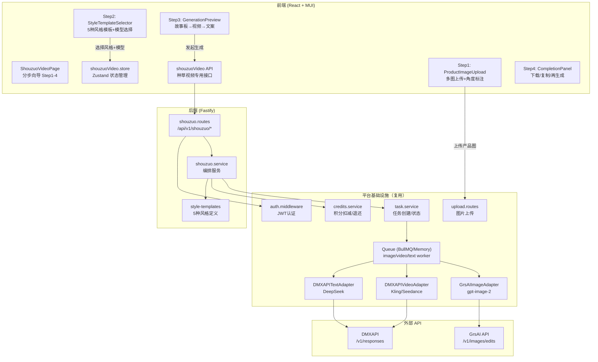
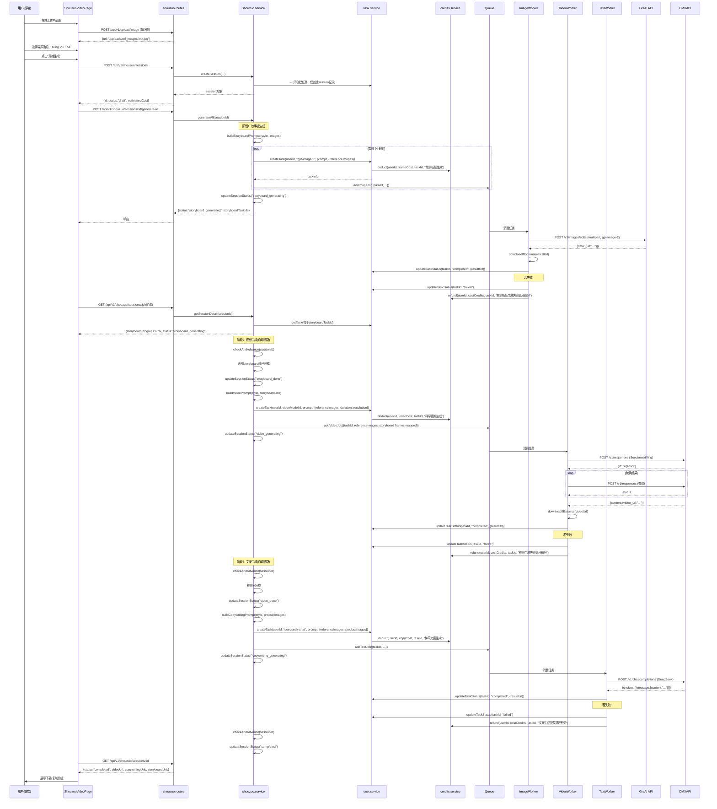
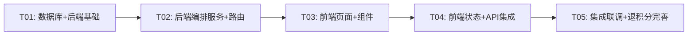

# 手作博主 AI 成品种草视频生成器 — 系统架构设计

> 版本：v1.0 | 作者：架构师 高见远（Gao） | 日期：2026-06-01

---

## 1. 系统架构总览

### 1.1 模块划分

本模块作为「智影工厂」平台的新功能嵌入，非独立项目。架构上**最大化复用**现有平台基础设施（认证、积分、任务队列、适配器层），新增以下子系统：

| 层次 | 新增模块 | 说明 |
|------|----------|------|
| 前端页面 | `ShouzuoVideoPage` | 单页分步向导（Step 1-4），独立路由 `/shouzuo-video` |
| 前端组件 | `ShouzuoVideo/` 目录 | 上传、模板选择、故事板预览、视频预览、文案卡片 |
| 前端状态 | `shouzuoVideo.store.ts` | Zustand store 管理向导步骤与生成状态 |
| 前端API | `shouzuoVideo.ts` | 封装种草视频专用 API 调用 |
| 后端路由 | `shouzuo.routes.ts` | 种草视频专用端点（故事板生成、一键发起视频+文案） |
| 后端服务 | `shouzuo.service.ts` | 编排服务：故事板生成 → 视频生成 → 文案生成 |
| 数据库 | `shouzuo_sessions` 表 | 记录完整会话（上传图→模板→故事板→视频→文案） |
| 队列 | 复用现有 image/video/text worker | 故事板帧用 image worker（GPT-Image-2），视频/文案用现有 worker |

### 1.2 与现有平台的关系

```
┌──────────────────────────────────────────────────────────┐
│                    智影工厂平台（现有）                      │
│  ┌────────────┐  ┌────────────┐  ┌────────────────────┐  │
│  │ 认证/积分   │  │ 任务队列    │  │ 适配器层            │  │
│  │ (复用)      │  │ (复用)      │  │ DMXAPI/GrsAI(复用) │  │
│  └─────┬──────┘  └─────┬──────┘  └────────┬───────────┘  │
│        │               │                  │               │
│  ┌─────▼───────────────▼──────────────────▼───────────┐  │
│  │        手作博主 AI 成品种草视频生成器（新增）          │  │
│  │  ┌─────────────┐  ┌──────────────┐  ┌───────────┐  │  │
│  │  │ShouzuoVideo │  │ShouzuoService│  │ 5种风格    │  │  │
│  │  │Page(前端)   │  │(编排服务)     │  │ 模板定义   │  │  │
│  │  └─────────────┘  └──────────────┘  └───────────┘  │  │
│  └────────────────────────────────────────────────────┘  │
│  ┌────────────────────────────────────────────────────┐  │
│  │              现有工作台 WorkspacePage                │  │
│  └────────────────────────────────────────────────────┘  │
└──────────────────────────────────────────────────────────┘
```

### 1.3 Mermaid 架构图



---

## 2. 数据库设计

### 2.1 新增表：`shouzuo_sessions`

记录一次完整的种草视频生成会话（从上传到最终结果）。

```sql
CREATE TABLE IF NOT EXISTS shouzuo_sessions (
  id              TEXT    PRIMARY KEY,                    -- UUID v4
  user_id         INTEGER NOT NULL REFERENCES users(id), -- 所属用户
  style_template  TEXT    NOT NULL,                      -- 风格模板标识: morihealing / japanfresh / retroart / cinematic / minimalist
  video_model     TEXT    NOT NULL,                      -- 视频模型: kling-v3 / seedance-2.0
  video_duration  INTEGER NOT NULL DEFAULT 5,            -- 视频时长(秒): 5 或 10
  product_images  TEXT    NOT NULL,                      -- JSON: [{url, angle_label}] 产品图列表
  storyboard_task_ids TEXT,                              -- JSON: [taskId,...] 故事板帧生成任务ID列表
  storyboard_urls TEXT,                                 -- JSON: [url,...] 故事板帧图片URL列表(完成后填充)
  video_task_id   TEXT,                                  -- 视频生成任务ID
  video_url       TEXT,                                  -- 视频结果URL
  copywriting_task_id TEXT,                              -- 文案生成任务ID
  copywriting_urls TEXT,                                -- JSON: [url,...] 文案文件URL列表
  status          TEXT    NOT NULL DEFAULT 'draft',      -- draft/storyboard_generating/storyboard_done/video_generating/video_done/copywriting_generating/completed/failed
  total_cost      INTEGER NOT NULL DEFAULT 0,            -- 总消耗积分
  error_message   TEXT,                                  -- 失败原因
  created_at      TEXT    NOT NULL DEFAULT (datetime('now')),
  updated_at      TEXT    NOT NULL DEFAULT (datetime('now'))
);

CREATE INDEX idx_shouzuo_sessions_user ON shouzuo_sessions(user_id);
CREATE INDEX idx_shouzuo_sessions_status ON shouzuo_sessions(status);
```

### 2.2 现有表变更

**无需修改现有表结构**。故事板帧、视频、文案各自作为独立的 `generation_tasks` 记录，由 `shouzuo_sessions` 通过外键字段关联。这样完全复用现有任务系统的状态追踪、积分扣退、Worker 处理逻辑。

### 2.3 字段说明

| 字段 | 说明 |
|------|------|
| `product_images` | 用户上传的产品图，JSON 数组 `[{url: "/uploads/ref_images/xxx.jpg", angle_label: "正面"}]`，1-5 张 |
| `storyboard_task_ids` | 故事板帧的 generation_task ID 列表，每帧一个 image 生成任务 |
| `storyboard_urls` | 故事板帧完成后，各帧图片的 URL 列表，作为视频模型的参考图 |
| `video_model` | 用户选择的视频模型标识，映射到实际 `ai_models.id` |
| `status` 状态机 | `draft` → `storyboard_generating` → `storyboard_done` → `video_generating` → `video_done` → `copywriting_generating` → `completed`；任何阶段技术失败 → `failed` |

---

## 3. API 设计

### 3.1 端点列表

| Method | Path | 说明 |
|--------|------|------|
| POST | `/api/v1/shouzuo/sessions` | 创建种草视频会话（上传图+选模板后调用） |
| GET | `/api/v1/shouzuo/sessions/:id` | 获取会话详情 |
| POST | `/api/v1/shouzuo/sessions/:id/storyboard` | 发起故事板生成 |
| POST | `/api/v1/shouzuo/sessions/:id/video` | 发起视频生成 |
| POST | `/api/v1/shouzuo/sessions/:id/copywriting` | 发起文案生成 |
| POST | `/api/v1/shouzuo/sessions/:id/generate-all` | 一键发起完整链路（故事板→视频→文案） |
| GET | `/api/v1/shouzuo/style-templates` | 获取风格模板列表 |
| GET | `/api/v1/shouzuo/sessions` | 获取用户的种草视频历史列表 |

### 3.2 端点详细设计

#### 3.2.1 `POST /api/v1/shouzuo/sessions` — 创建会话

**请求 Body：**
```json
{
  "productImages": [
    { "url": "/uploads/ref_images/xxx.jpg", "angleLabel": "正面" },
    { "url": "/uploads/ref_images/yyy.jpg", "angleLabel": "侧面" }
  ],
  "styleTemplate": "morihealing",
  "videoModel": "kling-v3",
  "videoDuration": 5
}
```

**响应：**
```json
{
  "code": 201,
  "data": {
    "id": "uuid-xxx",
    "status": "draft",
    "styleTemplate": "morihealing",
    "videoModel": "kling-v3",
    "videoDuration": 5,
    "productImages": [...],
    "estimatedCost": {
      "storyboard": 10,
      "video": 30,
      "copywriting": 5,
      "total": 45
    },
    "createdAt": "2026-06-01 14:30:00"
  },
  "message": "ok"
}
```

**业务逻辑：**
1. 验证 `productImages` 1-5 张，URL 均为合法的上传路径
2. 验证 `styleTemplate` 为 5 种预定义值之一
3. 验证 `videoModel` 为 `kling-v3` 或 `seedance-2.0`
4. 计算预估积分消耗（故事板帧数 × 单价 + 视频积分 + 文案积分）
5. 创建 `shouzuo_sessions` 记录，状态 `draft`
6. **不扣积分**，积分在各子任务创建时扣减

---

#### 3.2.2 `POST /api/v1/shouzuo/sessions/:id/storyboard` — 发起故事板生成

**请求 Body：**
```json
{
  "frameCount": 5
}
```

**响应：**
```json
{
  "code": 200,
  "data": {
    "sessionId": "uuid-xxx",
    "status": "storyboard_generating",
    "storyboardTaskIds": ["task-1", "task-2", "task-3", "task-4", "task-5"],
    "estimatedTimeSeconds": 60
  },
  "message": "ok"
}
```

**业务逻辑：**
1. 查询 session，验证 status 为 `draft`
2. 根据 `styleTemplate` + `productImages` 构造每帧的 prompt（见第 9 节）
3. 为每帧创建 `generation_tasks`（type=image, model_id=gpt-image-2），**逐帧扣减积分**
4. 将第一张产品图作为 `edit_source`，后续产品图作为 `reference_image` 传入 GrsAI
5. 将所有帧任务 ID 写入 `shouzuo_sessions.storyboard_task_ids`
6. 更新 session 状态为 `storyboard_generating`
7. 推入 image worker 队列
8. 前端轮询 session 详情获取故事板进度

**Prompt 构造策略（核心）：**
- 每帧 prompt = `{风格关键词} product showcase scene, {帧序号描述}, {色调描述}, professional product photography, soft lighting, 9:16 vertical composition`
- 第一张产品图以 `edit_source` 角色传入 → GPT-Image-2 图生图，保留产品外观
- 其余产品图以 `reference_image` 角色传入 → 提供多角度参考

---

#### 3.2.3 `POST /api/v1/shouzuo/sessions/:id/video` — 发起视频生成

**请求 Body：** 无（使用 session 中已保存的参数）

**响应：**
```json
{
  "code": 200,
  "data": {
    "sessionId": "uuid-xxx",
    "status": "video_generating",
    "videoTaskId": "task-video-1",
    "estimatedTimeSeconds": 300
  },
  "message": "ok"
}
```

**业务逻辑：**
1. 查询 session，验证 status 为 `storyboard_done`
2. 验证 `storyboard_urls` 非空（故事板帧已生成完毕）
3. 构造视频生成 prompt（融合风格模板关键词）
4. **故事板帧 → 视频模型参考图映射规则**（见第 6 节）：
   - Seedance：首帧 `first_frame` = storyboard_urls[0]，其余帧 = `reference_image`
   - Kling：首帧 `first_frame` = storyboard_urls[0]，末帧 `last_frame` = storyboard_urls[-1]（仅当帧数≥2时）
5. 创建 `generation_tasks`（type=video），扣减积分
6. 更新 session 状态为 `video_generating`
7. 推入 video worker 队列

---

#### 3.2.4 `POST /api/v1/shouzuo/sessions/:id/copywriting` — 发起文案生成

**请求 Body：** 无

**响应：**
```json
{
  "code": 200,
  "data": {
    "sessionId": "uuid-xxx",
    "status": "copywriting_generating",
    "copywritingTaskId": "task-text-1",
    "estimatedTimeSeconds": 15
  },
  "message": "ok"
}
```

**业务逻辑：**
1. 查询 session，验证 status 为 `video_done` 或 `video_generating`（允许视频还在生成时就开始文案）
2. 构造文案 prompt：包含风格关键词、产品图描述、小红书风格要求（emoji、话题标签等）
3. 产品图以 `reference_image` 角色传入 DeepSeek Vision
4. 创建 `generation_tasks`（type=text, model_id=deepseek-chat），扣减积分
5. 更新 session 状态为 `copywriting_generating`

---

#### 3.2.5 `POST /api/v1/shouzuo/sessions/:id/generate-all` — 一键发起完整链路

**请求 Body：** 无

**响应：**
```json
{
  "code": 200,
  "data": {
    "sessionId": "uuid-xxx",
    "status": "storyboard_generating",
    "storyboardTaskIds": ["task-1", "task-2", "task-3", "task-4", "task-5"],
    "pipelineStatus": "storyboard → video → copywriting (auto-chained)"
  },
  "message": "ok"
}
```

**业务逻辑：**
1. 验证 session status 为 `draft`
2. 发起故事板生成（同 3.2.2）
3. 在 shouzuo.service 中注册"故事板完成回调"：当所有故事板帧完成后，自动发起视频生成
4. 视频完成后，自动发起文案生成
5. 任何步骤技术失败 → 自动退该步骤积分 → 更新 session 状态为 `failed`
6. 前端只需轮询 session 详情即可跟踪全流程

**自动链路机制：** 在 `shouzuo.service` 中增加一个定时检查器（复用内存队列的定时检查模式），每 3 秒扫描 `storyboard_generating` / `video_generating` / `copywriting_generating` 状态的 session，检查关联子任务是否全部完成，若完成则自动推进到下一阶段。

---

#### 3.2.6 `GET /api/v1/shouzuo/style-templates` — 获取风格模板列表

**响应：**
```json
{
  "code": 200,
  "data": [
    {
      "id": "morihealing",
      "name": "森系治愈",
      "description": "自然、清新、治愈系，适合手工皂、蜡烛、植物产品",
      "colorTone": "浅绿+原木色+暖白",
      "thumbnailUrl": "/uploads/style_thumbs/morihealing.jpg",
      "keywords": ["natural", "healing", "botanical", "soft light", "wooden texture"]
    },
    ...
  ],
  "message": "ok"
}
```

---

#### 3.2.7 `GET /api/v1/shouzuo/sessions/:id` — 获取会话详情

**响应：**
```json
{
  "code": 200,
  "data": {
    "id": "uuid-xxx",
    "styleTemplate": "morihealing",
    "videoModel": "kling-v3",
    "videoDuration": 5,
    "productImages": [...],
    "storyboardTaskIds": ["task-1", ...],
    "storyboardUrls": ["/uploads/storyboard/frame1.jpg", ...],
    "storyboardProgress": 80,
    "videoTaskId": "task-video-1",
    "videoUrl": null,
    "videoProgress": 0,
    "copywritingTaskId": null,
    "copywritingUrls": null,
    "status": "storyboard_generating",
    "totalCost": 10,
    "estimatedCost": { "storyboard": 10, "video": 30, "copywriting": 5, "total": 45 },
    "errorMessage": null,
    "createdAt": "2026-06-01 14:30:00"
  },
  "message": "ok"
}
```

**业务逻辑：**
1. 查询 session 基础信息
2. 查询关联的 storyboard / video / copywriting 任务，计算各阶段进度
3. 返回聚合信息

---

#### 3.2.8 `GET /api/v1/shouzuo/sessions` — 获取用户历史列表

**Query Params：** `page`, `pageSize`, `status`（可选过滤）

**响应：** 标准分页格式，返回 session 列表摘要。

---

## 4. 前端组件树与路由

### 4.1 页面路由

在 `router.tsx` 的 `<AppLayout>` 内新增：

```tsx
<Route path="shouzuo-video" element={<ShouzuoVideoPage />} />
```

同时在 Sidebar 导航中添加入口。

### 4.2 组件树结构

```
ShouzuoVideoPage
├── StepIndicator                    // 顶部步骤条: ①上传 → ②选模板 → ③生成预览 → ④完成
├── StepContent (根据 activeStep 渲染)
│   ├── [Step 0] ProductImageUpload  // 多图上传 + 角度标注
│   │   ├── DropZone                 // 拖拽上传区域
│   │   ├── ImageThumbnailGrid       // 缩略图网格 (1-5张)
│   │   │   └── ImageThumbnailCard   // 单张缩略图 + 角度标签编辑 + 删除
│   │   └── AngleLabelDialog         // 角度标注弹窗（正面/侧面/俯视/细节/背面）
│   ├── [Step 1] StyleTemplateSelector // 风格模板选择
│   │   ├── StyleTemplateGrid         // 5个模板卡片网格
│   │   │   └── StyleTemplateCard     // 单个模板卡片（缩略图+名称+色调描述）
│   │   └── VideoModelSelector        // 模型选项卡（Kling V3 / Seedance 2.0 + 积分标注）
│   │       └── ModelOptionCard       // 模型卡片（名称+积分消耗+时长选项）
│   ├── [Step 2] GenerationPreview   // 生成预览
│   │   ├── StoryboardTimeline        // 故事板帧时间线（水平滚动）
│   │   │   └── StoryboardFrameCard   // 单帧缩略图（加载中/已完成状态）
│   │   ├── VideoPlayer               // 视频播放器（加载中/播放状态）
│   │   ├── CopywritingList           // 文案列表
│   │   │   └── CopywritingCard       // 单条文案（内容+复制按钮+字数）
│   │   └── ProgressOverlay           // 全局进度覆盖层
│   └── [Step 3] CompletionPanel     // 完成面板
│       ├── VideoDownloadButton       // 一键下载 MP4
│       ├── CopywritingCopyAllButton  // 复制所有文案
│       └── RegenerateButton          // 再生成一条
└── BottomActionBar                  // 底部固定操作按钮（下一步/上一步/发起生成）
```

### 4.3 状态管理设计（Zustand Store）

```typescript
// shouzuoVideo.store.ts

interface ShouzuoVideoState {
  // --- 向导步骤 ---
  activeStep: 0 | 1 | 2 | 3;              // 当前步骤

  // --- Step 0: 产品图 ---
  productImages: ProductImage[];            // [{url, angleLabel, file}]

  // --- Step 1: 模板+模型 ---
  selectedStyle: StyleTemplateId | null;    // 风格模板ID
  selectedVideoModel: 'kling-v3' | 'seedance-2.0'; // 视频模型
  selectedDuration: 5 | 10;                // 视频时长

  // --- Step 2-3: 生成状态 ---
  sessionId: string | null;                 // 会话ID
  sessionStatus: SessionStatus;             // 会话状态
  storyboardUrls: string[];                 // 故事板帧URL
  storyboardProgress: number;               // 0-100
  videoUrl: string | null;                  // 视频URL
  videoProgress: number;                    // 0-100
  copywritingUrls: string[];                // 文案URL列表
  copywritingProgress: number;              // 0-100
  errorMessage: string | null;              // 错误信息

  // --- 积分预估 ---
  estimatedCost: { storyboard: number; video: number; copywriting: number; total: number };

  // --- Actions ---
  setActiveStep: (step: 0 | 1 | 2 | 3) => void;
  addProductImage: (img: ProductImage) => void;
  removeProductImage: (index: number) => void;
  updateAngleLabel: (index: number, label: string) => void;
  setSelectedStyle: (style: StyleTemplateId) => void;
  setSelectedVideoModel: (model: 'kling-v3' | 'seedance-2.0') => void;
  setSelectedDuration: (duration: 5 | 10) => void;
  setSessionId: (id: string) => void;
  updateSessionStatus: (status: SessionStatus) => void;
  updateStoryboard: (urls: string[], progress: number) => void;
  updateVideo: (url: string | null, progress: number) => void;
  updateCopywriting: (urls: string[], progress: number) => void;
  setError: (msg: string | null) => void;
  resetAll: () => void;
}

type SessionStatus =
  | 'draft'
  | 'storyboard_generating'
  | 'storyboard_done'
  | 'video_generating'
  | 'video_done'
  | 'copywriting_generating'
  | 'completed'
  | 'failed';

type StyleTemplateId = 'morihealing' | 'japanfresh' | 'retroart' | 'cinematic' | 'minimalist';

interface ProductImage {
  url: string;          // 上传后的服务器路径
  angleLabel: string;   // 角度标注
  file?: File;          // 原始文件（上传前暂存）
}
```

---

## 5. 关键流程时序图

### 5.1 完整流程：上传 → 故事板 → 视频 → 文案 → 失败退积分



---

## 6. 多图合成技术方案（核心）

### 6.1 主方案：GPT-Image-2 故事板 → 视频模型参考图

**核心思路：** 多角度产品图不直接传给视频模型（视频模型对多图合成的支持有限），而是先用 GPT-Image-2 将多角度产品图融合成 4-6 帧故事板分镜图，再将故事板帧作为视频模型的参考图。

```
产品图1(正面) ─┐
产品图2(侧面) ─┤  GPT-Image-2   故事板帧1(开箱) ─┐
产品图3(俯视) ─┼ ─────────────→ 故事板帧2(特写) ─┤  Kling/Seedance ──→ 最终视频
产品图4(细节) ─┤  (图生图)      故事板帧3(场景) ─┤  (首帧+参考图)
               │                故事板帧4(收尾) ─┘
               └─ edit_source / reference_image
```

### 6.2 Seedance 参考图能力分析

| 角色 | 支持情况 | 说明 |
|------|----------|------|
| `first_frame` | 完全支持 | 首帧图像，视频从这里开始生成 |
| `last_frame` | 完全支持 | 末帧图像，视频向这个画面过渡 |
| `reference_image` | 完全支持 | 参考图，提供风格/内容参考 |

**Seedance 映射规则：**
- `storyboard_urls[0]` → `first_frame`（首帧强约束）
- `storyboard_urls[1..n-2]` → `reference_image`（中间帧风格引导）
- `storyboard_urls[n-1]` → `last_frame`（末帧目标，仅当帧数≥3）

**优势：** Seedance 支持 `reference_image`，可以传入多帧故事板作为风格参考，保持视频与故事板的一致性。

### 6.3 Kling V3 参考图能力分析

| 角色 | 支持情况 | 说明 |
|------|----------|------|
| `first_frame` | 完全支持 | 首帧图像 |
| `last_frame` | 完全支持 | 末帧图像 |
| `reference_image` | 映射为 `first_frame` | 不原生支持，代码中自动映射 |

**Kling 映射规则：**
- `storyboard_urls[0]` → `first_frame`（首帧）
- `storyboard_urls[n-1]` → `last_frame`（末帧，仅当帧数≥2）
- 中间帧无法传入（Kling 限制），需在 prompt 中描述中间帧内容

**缓解措施：** 将中间帧的视觉描述融入视频 prompt 文本中，弥补无法传入参考图的不足。

### 6.4 故事板帧 → 视频模型映射规则汇总

```typescript
// shouzuo.service.ts 中的映射逻辑

function mapStoryboardToVideoReferences(
  storyboardUrls: string[],
  videoModel: 'kling-v3' | 'seedance-2.0'
): ReferenceImage[] {
  const refs: ReferenceImage[] = [];

  if (videoModel === 'seedance-2.0') {
    // Seedance: 首帧 + 参考图 + 末帧
    refs.push({ url: storyboardUrls[0], role: 'first_frame' });
    for (let i = 1; i < storyboardUrls.length - 1; i++) {
      refs.push({ url: storyboardUrls[i], role: 'reference_image' });
    }
    if (storyboardUrls.length >= 3) {
      refs.push({ url: storyboardUrls[storyboardUrls.length - 1], role: 'last_frame' });
    }
  } else {
    // Kling: 仅首帧 + 末帧
    refs.push({ url: storyboardUrls[0], role: 'first_frame' });
    if (storyboardUrls.length >= 2) {
      refs.push({ url: storyboardUrls[storyboardUrls.length - 1], role: 'last_frame' });
    }
  }

  return refs;
}
```

### 6.5 Prompt 构造策略

#### 6.5.1 故事板 Prompt 构造

每帧使用统一的模板，根据帧序号注入不同的场景描述：

```
[风格关键词], product showcase scene {帧场景描述},
{色调描述}, professional product photography,
soft natural lighting, 9:16 vertical composition,
detailed texture, aesthetic arrangement,
handmade craft product, warm and inviting atmosphere
```

**帧场景描述（默认 5 帧分配）：**
- 帧1 (开箱/呈现)：`unboxing scene, hands gently lifting product from packaging, revealing the beautiful handmade item`
- 帧2 (特写)：`close-up shot highlighting product texture and fine details, shallow depth of field`
- 帧3 (使用场景)：`lifestyle scene, product in natural use context, cozy environment`
- 帧4 (多角度展示)：`multiple angle showcase, product rotating display, showing craftsmanship`
- 帧5 (收尾/氛围)：`final atmospheric shot, product resting on styled surface, dreamy bokeh background`

#### 6.5.2 视频 Prompt 构造

```
[风格关键词] product video, cinematic product showcase,
{色调描述}, smooth camera movement,
professional product photography style,
9:16 vertical format, {视频时长} seconds,
{风格专属场景描述},
handmade craft product, elegant presentation,
gentle transitions, aesthetic composition
```

#### 6.5.3 文案 Prompt 构造

```
你是一位小红书种草博主，请根据产品图片和风格生成3-5条种草文案。

风格：{风格中文名}
要求：
1. 每条文案包含标题+正文+话题标签
2. 使用小红书风格：emoji点缀、口语化、真实感
3. 突出手工制作/匠心质感
4. 文案长度150-300字
5. 包含3-5个相关话题标签

{风格专属文案指引}
```

---

## 7. 文件清单

### 7.1 新增文件

#### 后端（server/src/）

| 文件路径 | 说明 |
|----------|------|
| `services/shouzuo.service.ts` | 种草视频编排服务：会话管理、故事板/视频/文案编排、自动链路推进 |
| `routes/shouzuo.routes.ts` | 种草视频专用路由：8个端点 |
| `config/style-templates.ts` | 5种风格模板定义：关键词、prompt模板、色调、文案指引 |
| `queue/shouzuo.worker.ts` | 种草视频会话状态推进 worker：定时检查 session 状态，自动链路 |

#### 前端（client/src/）

| 文件路径 | 说明 |
|----------|------|
| `pages/ShouzuoVideoPage.tsx` | 种草视频主页面：分步向导容器 |
| `components/ShouzuoVideo/StepIndicator.tsx` | 步骤条组件 |
| `components/ShouzuoVideo/ProductImageUpload.tsx` | Step1：多图上传+角度标注 |
| `components/ShouzuoVideo/StyleTemplateSelector.tsx` | Step2：风格模板选择+模型选项 |
| `components/ShouzuoVideo/GenerationPreview.tsx` | Step3：故事板+视频+文案预览 |
| `components/ShouzuoVideo/CompletionPanel.tsx` | Step4：完成面板 |
| `components/ShouzuoVideo/BottomActionBar.tsx` | 底部固定操作按钮 |
| `components/ShouzuoVideo/StoryboardTimeline.tsx` | 故事板帧时间线 |
| `components/ShouzuoVideo/VideoPlayer.tsx` | 视频播放器 |
| `components/ShouzuoVideo/CopywritingCard.tsx` | 文案卡片 |
| `stores/shouzuoVideo.store.ts` | Zustand 状态管理 |
| `api/shouzuoVideo.ts` | 种草视频 API 封装 |
| `hooks/useShouzuoSession.ts` | 会话轮询 hook |
| `hooks/useShouzuoVideo.ts` | 种草视频业务逻辑 hook |

### 7.2 修改文件

| 文件路径 | 修改说明 |
|----------|----------|
| `server/src/routes/index.ts` | 注册 `shouzuoRoutes`，前缀 `/api/v1/shouzuo` |
| `server/src/db/migrate.ts` | 新增 `shouzuo_sessions` 表的 CREATE TABLE 迁移 |
| `server/src/types/index.ts` | 新增种草视频相关类型定义 |
| `client/src/router.tsx` | 新增 `/shouzuo-video` 路由 |
| `client/src/components/Layout/Sidebar.tsx` | 侧边栏新增"种草视频"入口 |

---

## 8. 任务分解

### 8.1 任务依赖图



### 8.2 任务详情

---

#### T01: 数据库 + 后端基础（故事板服务 + 类型 + 风格模板）

**文件范围：**
- `server/src/db/migrate.ts`（新增 shouzuo_sessions 表迁移）
- `server/src/types/index.ts`（新增种草视频类型）
- `server/src/config/style-templates.ts`（5种风格模板定义）
- `server/src/routes/index.ts`（注册新路由前缀）

**依赖：** 无

**优先级：** P0

**验收标准：**
1. `shouzuo_sessions` 表可通过迁移脚本创建
2. 5种风格模板常量可被其他模块导入使用
3. TypeScript 类型定义完整，覆盖 Session / StyleTemplate / 请求/响应
4. 新路由前缀在 routes/index.ts 中注册（路由文件暂为空壳）

---

#### T02: 后端编排服务 + 路由

**文件范围：**
- `server/src/services/shouzuo.service.ts`（编排服务核心）
- `server/src/routes/shouzuo.routes.ts`（8个端点）
- `server/src/queue/shouzuo.worker.ts`（会话状态推进 worker）

**依赖：** T01

**优先级：** P0

**验收标准：**
1. 8个 API 端点全部可用，可通过 curl 测试
2. `createSession` 正确创建 session 记录
3. `generateStoryboard` 能为 4-6 帧创建 image 任务并推入队列
4. `generateVideo` 在故事板完成后创建 video 任务，正确映射参考图
5. `generateCopywriting` 创建 text 任务，产品图作为 Vision 参考
6. `generateAll` 一键发起链路
7. shouzuo.worker 定时检查并自动推进会话状态
8. 各阶段积分正确扣减

---

#### T03: 前端页面 + 组件

**文件范围：**
- `client/src/pages/ShouzuoVideoPage.tsx`（主页面）
- `client/src/components/ShouzuoVideo/StepIndicator.tsx`
- `client/src/components/ShouzuoVideo/ProductImageUpload.tsx`
- `client/src/components/ShouzuoVideo/StyleTemplateSelector.tsx`
- `client/src/components/ShouzuoVideo/GenerationPreview.tsx`
- `client/src/components/ShouzuoVideo/CompletionPanel.tsx`
- `client/src/components/ShouzuoVideo/BottomActionBar.tsx`
- `client/src/components/ShouzuoVideo/StoryboardTimeline.tsx`
- `client/src/components/ShouzuoVideo/VideoPlayer.tsx`
- `client/src/components/ShouzuoVideo/CopywritingCard.tsx`
- `client/src/router.tsx`（新增路由）
- `client/src/components/Layout/Sidebar.tsx`（新增入口）

**依赖：** T01

**优先级：** P0

**验收标准：**
1. `/shouzuo-video` 路由可访问
2. 4步向导 UI 完整：上传 → 选模板 → 生成预览 → 完成
3. Step1: 支持拖拽上传 1-5 张图，每张可标注角度
4. Step2: 5个模板卡片 + 2个模型选项卡（标注积分消耗）
5. Step3: 故事板时间线 + 视频播放器 + 文案列表
6. Step4: 下载/复制/再生成按钮
7. 底部固定操作栏，步骤间可前进/后退
8. 侧边栏有"种草视频"入口

---

#### T04: 前端状态 + API 集成

**文件范围：**
- `client/src/stores/shouzuoVideo.store.ts`（Zustand store）
- `client/src/api/shouzuoVideo.ts`（API 封装）
- `client/src/hooks/useShouzuoSession.ts`（会话轮询 hook）
- `client/src/hooks/useShouzuoVideo.ts`（业务逻辑 hook）

**依赖：** T02, T03

**优先级：** P0

**验收标准：**
1. Store 正确管理向导步骤和生成状态
2. API 封装覆盖所有 8 个端点
3. useShouzuoSession hook 实现轮询，实时更新故事板/视频/文案进度
4. useShouzuoVideo hook 封装完整的用户操作流程
5. 前端组件通过 hooks 和 store 驱动，无直接 API 调用
6. 积分不足时弹窗提示

---

#### T05: 集成联调 + 退积分完善

**文件范围：**
- `server/src/services/shouzuo.service.ts`（退积分逻辑完善）
- `server/src/queue/shouzuo.worker.ts`（链路异常处理完善）
- `client/src/pages/ShouzuoVideoPage.tsx`（联调修复）
- `client/src/components/ShouzuoVideo/GenerationPreview.tsx`（失败退积分提示UI）
- `client/src/components/ShouzuoVideo/CompletionPanel.tsx`（下载/复制功能）

**依赖：** T04

**优先级：** P1

**验收标准：**
1. 完整链路可用：上传 → 故事板 → 视频 → 文案 → 下载
2. 故事板帧失败 → 自动退积分 + 无限重试
3. 视频生成失败 → 自动退积分 + 无限重试
4. 文案生成失败 → 自动退积分 + 无限重试
5. 主观不满意 → 不退积分（无退积分按钮）
6. 界面展示技术失败的退积分提示
7. 视频下载功能可用
8. 文案复制功能可用
9. "再生成一条"功能可用（重新发起完整链路）

---

## 9. 风格模板定义

### 9.1 五种风格详细定义

#### 森系治愈（morihealing）

| 属性 | 值 |
|------|-----|
| 中文名 | 森系治愈 |
| 色调 | 浅绿 + 原木色 + 暖白 |
| 适用产品 | 手工皂、蜡烛、植物系产品、棉麻制品 |
| 关键词 | natural, healing, botanical, soft light, wooden texture, moss green, linen, forest morning |
| 故事板 prompt 后缀 | `moss green and warm white tones, soft morning light filtering through leaves, wooden surface, dried flowers arrangement, gentle and healing atmosphere, earthy organic aesthetic` |
| 视频 prompt 后缀 | `mori healing style, soft dappled light through forest canopy, warm wooden textures, botanical elements, gentle camera drift, earthy organic color palette, peaceful natural atmosphere` |
| 文案指引 | `语气温柔治愈，多用🍃🌿✨等自然系emoji，强调"治愈感""自然力量""手作温度"` |

#### 日系清新（japanfresh）

| 属性 | 值 |
|------|-----|
| 中文名 | 日系清新 |
| 色调 | 薄荷绿 + 奶白 + 浅木色 |
| 适用产品 | 陶瓷器皿、和风文具、简约家居、日式点心 |
| 关键词 | Japanese minimal, fresh, clean, soft pastel, wabi-sabi, zen, morning light, subtle elegance |
| 故事板 prompt 后缀 | `mint green and milky white tones, soft diffused light, clean minimal composition, subtle Japanese aesthetic, gentle pastel accents, serene and fresh atmosphere` |
| 视频 prompt 后缀 | `Japanese fresh style, soft diffused morning light, clean minimal composition, subtle pastel palette, gentle camera movement, zen-like serenity, wabi-sabi elegance` |
| 文案指引 | `语气清新淡雅，多用🎐☁️🍃等淡色系emoji，强调"日式美学""极简之美""生活仪式感"` |

#### 复古文艺（retroart）

| 属性 | 值 |
|------|-----|
| 色调 | 焦糖色 + 奶油白 + 复古金 |
| 适用产品 | 手工皮具、复古首饰、老式文具、织物 |
| 关键词 | vintage, retro, warm caramel, nostalgic, antique gold, aged paper texture, classic elegance |
| 故事板 prompt 后缀 | `caramel and cream tones, warm vintage lighting, aged paper texture background, antique gold accents, nostalgic composition, classic retro elegance` |
| 视频 prompt 后缀 | `vintage retro style, warm golden hour lighting, caramel and cream color palette, nostalgic film grain texture, classic elegant atmosphere, slow cinematic movement` |
| 文案指引 | `语气文艺怀旧，多用🕯️📜🤎等复古系emoji，强调"时光质感""手工匠心""旧物之美"` |

#### 氛围感电影（cinematic）

| 属性 | 值 |
|------|-----|
| 色调 | 深蓝 + 暖橙 + 柔光 |
| 适用产品 | 香水、蜡烛、玻璃制品、高端手工品 |
| 关键词 | cinematic, dramatic lighting, moody, deep blue and warm amber, film noir, atmospheric, volumetric light |
| 故事板 prompt 后缀 | `deep blue and warm amber tones, dramatic cinematic lighting, volumetric light rays, moody atmospheric composition, film-like color grading, high contrast shadows` |
| 视频 prompt 后缀 | `cinematic film style, dramatic volumetric lighting, deep blue and warm amber contrast, moody atmospheric scene, film-like color grading, smooth cinematic camera movement` |
| 文案指引 | `语气沉浸感强，多用🎬🌙✨等电影系emoji，强调"氛围感""沉浸体验""光影艺术"` |

#### 极简高级（minimalist）

| 属性 | 值 |
|------|-----|
| 色调 | 纯白 + 浅灰 + 单色点缀 |
| 适用产品 | 极简家居、设计感产品、金属工艺品 |
| 关键词 | minimalist, premium, clean white, subtle gray, luxury, refined, architectural, negative space |
| 故事板 prompt 后缀 | `pure white and light gray tones, clean minimal composition, generous negative space, subtle single color accent, premium luxury feel, architectural precision` |
| 视频 prompt 后缀 | `minimalist premium style, clean white background, generous negative space, subtle gray tones, precise geometric composition, smooth elegant camera movement, luxury product presentation` |
| 文案指引 | `语气克制高级，多用▪️◻️⬜等极简符号，强调"极简设计""高级质感""少即是多"` |

### 9.2 风格模板代码结构

```typescript
// server/src/config/style-templates.ts

export interface StyleTemplate {
  id: string;
  name: string;
  description: string;
  colorTone: string;
  applicableProducts: string;
  keywords: string[];
  storyboardPromptSuffix: string;
  videoPromptSuffix: string;
  copywritingGuide: string;
  frameDescriptions: string[];  // 5帧默认场景描述
}

export const STYLE_TEMPLATES: Record<string, StyleTemplate> = {
  morihealing: { ... },
  japanfresh: { ... },
  retroart: { ... },
  cinematic: { ... },
  minimalist: { ... },
};
```

---

## 10. 依赖包与待明确事项

### 10.1 新增依赖包

**无需新增 npm 依赖**。所有功能均基于现有技术栈实现：
- 后端：Fastify + sql.js + 已有适配器
- 前端：React + MUI + Zustand + React Query + React Router
- 队列：BullMQ（已安装）/ 内存回退

### 10.2 待明确事项

| # | 问题 | 影响范围 | 建议默认值 |
|---|------|----------|-----------|
| 1 | 故事板帧数是固定 5 帧还是用户可选（4-6帧）？ | 前端 UI + 后端积分计算 | 默认 5 帧，暂不开放选择 |
| 2 | 故事板每帧的积分消耗？需要配置到 ai_models 表 | 积分计费 | gpt-image-2 现有价格 × 帧数 |
| 3 | 种草视频的 DeepSeek 文案积分消耗？ | 积分计费 | deepseek-chat 现有价格 |
| 4 | GPT-Image-2 多参考图传入方式：仅第一张 edit_source，其余 reference_image？确认 GrsAI 的 /v1/images/edits 是否支持多图 | 故事板质量 | 先按单图 edit_source 实现，多图作为 reference_image 传入 textToImage |
| 5 | "无限重试"是否有上限（如最多重试 5 次）？避免积分循环问题 | 失败重试逻辑 | 技术失败最多自动重试 3 次，之后标记 failed，用户手动触发重试 |
| 6 | 风格模板缩略图资源谁提供？ | 前端 UI | 先用占位图/渐变色，后续替换真实图 |
| 7 | Kling V3 不支持 reference_image，中间帧仅靠 prompt 描述，效果是否可接受？ | 视频质量 | 先实现，若效果不佳可考虑仅支持 Seedance 作为默认模型 |
| 8 | 视频生成 5s vs 10s 的积分差异需确认 | 积分展示 | 使用现有 ai_models 的 duration_pricing 配置 |
| 9 | 故事板帧是否需要用户确认/编辑后再生成视频？ | 产品流程 | MVP 阶段跳过用户确认，自动链路推进；后续可加"预览故事板→确认→生成视频" |
| 10 | `shouzuo_sessions` 中 video_model 字段存储的是模型显示名（kling-v3）还是 ai_models.id（kling-v3-video-generation）？ | 代码映射 | 存储 ai_models.id，前端展示映射名称 |

---

## 附录 A：数据库新增表完整 DDL

```sql
-- 种草视频会话表
CREATE TABLE IF NOT EXISTS shouzuo_sessions (
  id                    TEXT    PRIMARY KEY,
  user_id               INTEGER NOT NULL REFERENCES users(id),
  style_template        TEXT    NOT NULL,
  video_model           TEXT    NOT NULL,
  video_duration        INTEGER NOT NULL DEFAULT 5,
  product_images        TEXT    NOT NULL,
  storyboard_task_ids   TEXT,
  storyboard_urls       TEXT,
  video_task_id         TEXT,
  video_url             TEXT,
  copywriting_task_id   TEXT,
  copywriting_urls      TEXT,
  status                TEXT    NOT NULL DEFAULT 'draft',
  total_cost            INTEGER NOT NULL DEFAULT 0,
  error_message         TEXT,
  created_at            TEXT    NOT NULL DEFAULT (datetime('now')),
  updated_at            TEXT    NOT NULL DEFAULT (datetime('now'))
);

CREATE INDEX idx_shouzuo_sessions_user ON shouzuo_sessions(user_id);
CREATE INDEX idx_shouzuo_sessions_status ON shouzuo_sessions(status);
```

## 附录 B：ai_models 需新增的记录

确保以下模型记录存在于 `ai_models` 表中（可能已存在，需确认）：

| id | name | type | category | cost_credits | adapter_class | enabled |
|----|------|------|----------|-------------|---------------|---------|
| gpt-image-2 | GPT Image 2 | image | advanced | (待确认) | GrsAIImageAdapter | 1 |
| kling-v3-video-generation | Kling V3 | video | flagship | (待确认) | DMXAPIVideoAdapter | 1 |
| doubao-seedance-2-0-fast-260128 | Seedance 2.0 Fast | video | standard | (待确认) | DMXAPIVideoAdapter | 1 |
| deepseek-chat | DeepSeek Chat | text | standard | (待确认) | DMXAPITextAdapter | 1 |
