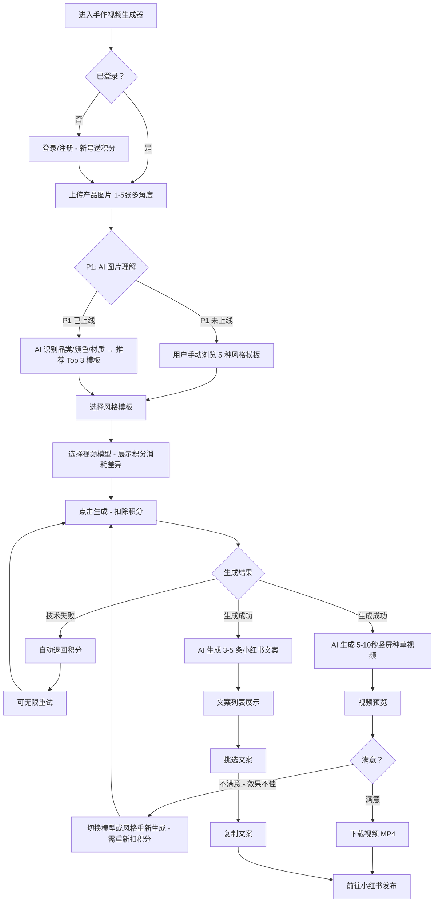

# 手作博主 AI 成品种草视频生成器 — 产品需求文档 (PRD)

## 项目信息

| 字段 | 值 |
|------|------|
| 项目名称 | shouzuo_video_generator |
| 语言 | 中文 |
| 技术栈 | Vite + React + MUI + Tailwind CSS |
| 所属平台 | 智影工厂 (zhiyingworks.cn) — AI 创作聚合平台垂直模块 |
| 文档版本 | v1.1 |

## 原始需求复述

面向小红书手作/原创设计博主（钩针、编织、陶艺、皮具等），提供一个 AI 驱动的「成品种草带货视频」一键生成工具。用户上传产品图后，系统自动识别品类、推荐风格模板、生成 5-10 秒竖屏种草视频，并附带小红书种草文案，帮助博主低门槛、低成本地产出高质量带货内容。

**关键区分**：只做「成品种草带货视频」，不做教程类内容。

---

## 1. 产品目标

让手作博主用 1-5 张产品图、3 分钟内生成可直接发布的小红书种草视频 + 文案，将单条视频制作成本从 30 分钟以上压缩到 3 分钟以内、费用控制在 ¥3 以内。

---

## 2. 用户故事

- **US-1**：作为钩针品牌主理人，我想上传成品照片就自动生成种草视频，这样不用花时间学剪辑也能持续发内容涨粉。
- **US-2**：作为手作博主，我想在多种视频风格中挑选最匹配我品牌调性的模板，这样发出去的内容风格统一、辨识度高。
- **US-3**：作为手作卖家，我想在生成视频的同时获得配套的小红书文案，这样不用额外写文案就能直接发布、缩短内容上架周期。
- **US-4**：作为手作博主，我想上传多角度产品图（正面+背面+细节），让 AI 合成到同一个视频中展示全貌，这样种草效果更完整。

---

## 3. 需求池

### P0 — Must Have（MVP 核心交付）

| 编号 | 需求 | 说明 |
|------|------|------|
| P0-1 | 产品图上传 | 支持上传 1-5 张产品图片（JPG/PNG/WEBP，单张 ≤ 10MB）；多图代表同一产品的不同角度（正面+背面+细节），需合成到同一视频中 |
| P0-2 | 多图合成视频 | 多图上传时，需将多角度图合成到同一视频中（非仅取首图）。需探索 Kling V3 / Seedance 2.0 的多图输入能力（first_frame / last_frame / reference_image 等角色组合），并制定 fallback 策略 |
| P0-3 | 风格模板选择 | 提供 5 种预设风格模板：森系治愈 / 日系清新 / 复古文艺 / 氛围感电影 / 极简高级，用户手动选择 |
| P0-4 | 种草视频生成 | 调用 Kling V3 或 Seedance 2.0 生成 5-10 秒竖屏（9:16）种草视频；用户可在两个模型间切换；界面需明确展示两个模型的积分消耗差异，供用户知情选择 |
| P0-5 | 小红书文案生成 | 调用 DeepSeek 生成 3-5 条小红书风格种草文案（含标题 + 正文 + 标签），仅基于图片 + 风格自动生成，无需用户额外输入商品名称/价格等信息 |
| P0-6 | 视频预览与下载 | 视频生成后在线预览、一键下载 MP4 |
| P0-7 | 生成失败检测与自动退积分 | 视频生成技术性失败（API 报错/超时/无输出）→ 自动退回积分，用户可无限重试直到成功；效果不佳（主观不满意但技术生成成功）→ 不退积分、不免费重试 |
| P0-8 | 积分计费体系 | 登录后使用，注册新号免费送积分（沿用平台现有机制），按积分收费，不采用一次性收费或免费试用逻辑 |
| P0-9 | 前端交互页面 | 上传 → 选模板 → 生成 → 预览/下载 完整流程的 Web 页面 |

### P1 — Should Have（体验增强）

| 编号 | 需求 | 说明 |
|------|------|------|
| P1-1 | AI 图片理解 | 调用 GPT-4o Vision 自动识别品类、颜色、材质、风格标签，用于智能推荐模板 |
| P1-2 | 智能模板推荐 | 基于图片理解结果，从 5 种模板中推荐 Top 3 匹配风格，并给出推荐理由 |
| P1-3 | 文案与视频风格联动 | 文案生成的 prompt 自动携带所选风格关键词，确保文案调性与视频一致 |

### P2 — Nice to Have（未来迭代）

| 编号 | 需求 | 说明 |
|------|------|------|
| P2-1 | 高级图片生成 | 基于产品图生成场景化产品图（如将钩织花放在木桌上） |
| P2-2 | 小红书一键发布 | 接入小红书开放 API，从平台直接发布视频 + 文案 |
| P2-3 | 模板自定义 | 博主上传参考视频，AI 学习其风格生成自定义模板 |
| P2-4 | 批量生成 | 一次上传多组产品图，批量生成视频 + 文案 |

---

## 4. 核心交互流程

---

## 5. UI 布局描述

整体采用**单页分步向导**布局，顶部显示步骤条（1→2→3→4），底部固定操作按钮。

### Step 1：上传产品图
- 居中大号拖拽上传区（虚线框 + 图标 + 提示文字"拖拽或点击上传产品图，支持多角度"）
- 下方缩略图预览行，支持多图上传（1-5 张），多图时每张标注角度提示（如"正面"、"背面"、"细节"）
- 右下角「下一步」按钮

### Step 2：选择风格模板
- 5 个模板卡片横排，每个卡片含：模板封面动图/GIF + 模板名称 + 一句话风格描述
- P1 阶段：推荐模板卡片右上角显示"AI 推荐"角标
- 选中卡片高亮描边
- 下方模型选择：Kling V3 / Seedance 2.0 两个选项卡，**每个选项卡旁标注积分消耗**（如 "Kling V3 · 10 积分" vs "Seedance 2.0 · 15 积分"）
- 底部「生成视频」主按钮，按钮旁提示本次消耗积分数

### Step 3：生成中 & 预览
- 生成中：视频区域显示骨架屏 + 进度条 + 预估时间提示
- 生成失败：提示"生成失败，积分已退回"，显示「重新生成」按钮（不额外扣积分）
- 生成完成：
  - 左侧：视频播放器（9:16 竖屏），下方「下载视频」按钮
  - 右侧：文案列表，每条包含标题 + 正文 + 标签，支持一键复制
  - 底部：「重新生成」（需重新扣积分）和「完成」两个按钮

### Step 4：完成
- 简洁成功页：视频缩略图 + 已选文案预览 + 「下载视频」「复制文案」操作
- 底部「再生成一条」链接，回到 Step 1

### 全局
- 左侧导航栏：在智影工厂平台导航中新增「手作视频」入口
- 顶部：当前用户信息 + 剩余积分余额

---

## 6. 已确认决策

| 编号 | 问题 | 决策结论 |
|------|------|----------|
| Q-1 | 重试与退费策略 | 技术性失败（API 报错/超时/无输出）→ 自动退回积分，用户可无限重试直到成功；主观效果不满意但技术生成成功 → 不退积分、不免费重试 |
| Q-2 | 多图处理方式 | 多图 = 多角度（正面+背面+细节），需合成到同一视频中展示产品全貌，不能只取首图。需探索 Kling V3 / Seedance 2.0 多图输入能力（first_frame / last_frame / reference_image 等角色组合），并制定 fallback 策略 |
| Q-3 | 模型价格展示 | 生成界面需明确展示 Kling V3 和 Seedance 2.0 的积分消耗差异，供用户知情选择 |
| Q-4 | 文案生成输入 | 仅基于图片 + 风格自动生成，不需要用户额外输入商品名称/价格等信息 |
| Q-5 | 收费与登录机制 | 登录后使用，注册新号免费送积分（沿用平台现有机制），按积分收费，不采用一次性收费或免费试用逻辑 |

---

## 附录：技术选型摘要

| 能力 | 模型 | 接入方式 |
|------|------|----------|
| 图片理解 | GPT-4o Vision | DMXAPI OpenAI 兼容端点 |
| 视频生成 | Kling V3 / Seedance 2.0 | DMXAPI 适配器（双模型接入） |
| 文案生成 | DeepSeek | DMXAPI 适配器 |
